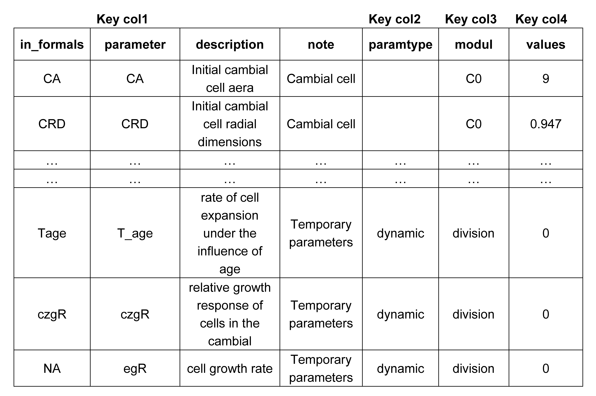
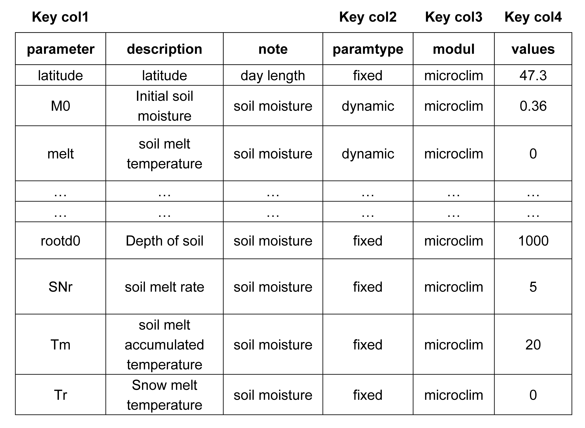
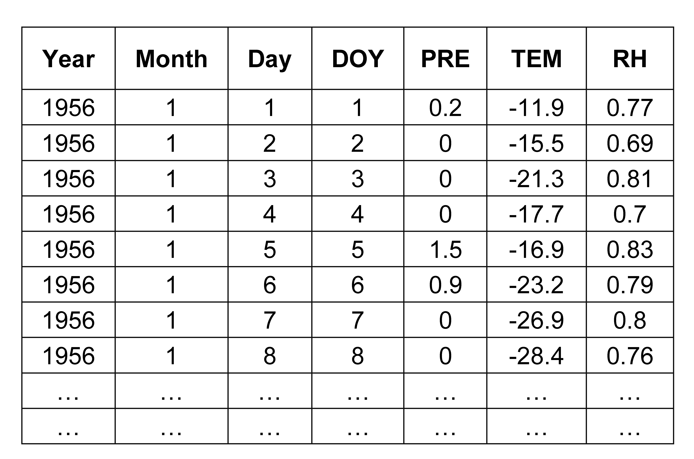
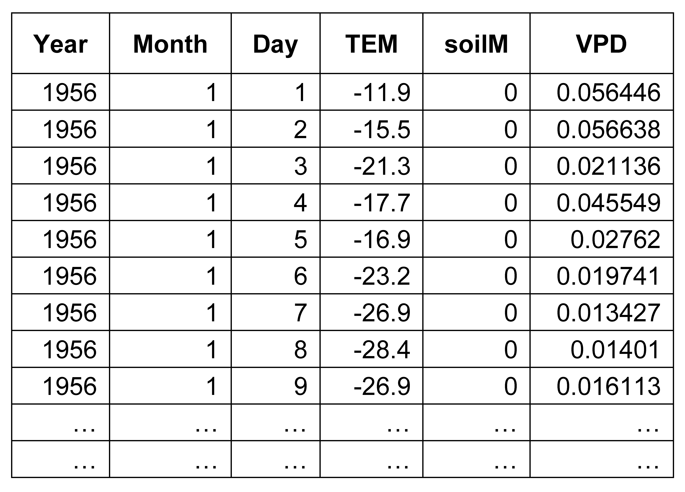

<!-- README.md is generated from README.Rmd. Please edit that file -->

# rBTR

<!-- badges: start -->

<!-- badges: end -->

**Rpackage for the BTR model is still under development.**


rBTR is an Rpackage of the Broadleaved Tree-Ring (BTR) model. 


## Installation

You can install the development version of BTR model like so:

```r
# devtools::install_github("kdoodk/rBTR")
```

## Example

This is a basic example which shows you how to solve a common problem:

#### Simulation

```r
library(rBTR)

## computer daylength, gE, soil moisture, VPD, etc.
Climate_data <- Compute_clim( climdata = LS_clim , parameters = Clim_param , syear = NA, eyear = NA )
# or computer daylength, gE , etc.
Climate_data <- Compute_clim( climdata = LS_climdata , parameters = Clim_param , syear = NA, eyear = NA )

## Simulate tree growth
Res <- btr( clim = Climate_data, parameters = BP_param, syear = NA, eyear = NA, intraannual = F)

```

#### Required data frame organization

1. ###### Gorwth parameters list
   
   Example growth parameters list.<br>
   Key cols are required columns in the data frame, they  are called in the BTR model.<br>
   Use `data(BP_param)` or` data(FM_param)` view sample parameter data frame.
   

2. ###### Climate parameters list
   
   Example climate parameters list. <br>
   Use `data(clim_param)` view sample parameter data frame.<br>
   If you only want to calculate the day length, set the parameter ***latitude***. <br>
   The remaining parameters are used to calculate soil moisture using the **cpc-leaky bucket** model.<br>
   Use `data(clim_param)` view sample parameter data frame.
   

3. ###### Climate data
   
   `Computer_clim()` function is used to generate the clim input data for the BTR model.<br>

   `Computer_clim()`function could use ***latitude*** to calculate ***Li (daylength)*** and ***gE (relative rate of cell growth driven by daylength)***,<br>
   ***MAT (mean air temperature)*** and ***PRE (precipitation)*** to calculate ***soilM (soil moisture)***, <br>
   ***RH (Relative Humidity)*** and ***MAT*** to calculate ***VPD (vapor pressure deficit)***.<br>

   Example climate data input.<br>
   Use `data(LS_clim)` view sample climate data.
   
   If you have more reliable ***soilM (soil moisture)*** or ***VPD*** data for the sample site, `Computer_clim()` will only calculate the missing parts.<br>
   Use `data(LS_climdata)` view sample climate data2.
   
